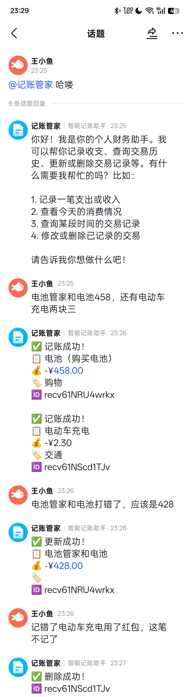

# LedgerBot - 飞书记账机器人

一个基于飞书平台和多维表格的智能记账机器人，**对自然语言非常友好**，支持自然语言输入和AI自动分类。



> 📖 **部署文档**：详细的部署步骤请参考 [部署文档](./docs/deployment.md)

## 功能特性

- 🤖 **AI智能识别**: 使用OpenAI GPT模型自动识别账单信息
- 💬 **自然语言友好**: 支持各种自然语言表达方式，无需特定格式，AI能理解你的意图
- 📊 **多维表格存储**: 数据直接存储在飞书多维表格中
- 🏷️ **智能分类**: AI根据描述自动推荐分类，无需手动选择
- 👤 **用户管理**: 支持飞书用户映射和重命名
- 📝 **原始消息记录**: 保存用户输入的完整原始消息
- ⏰ **精确时间**: 记录账单创建的具体时间（包含时分秒）
- 🔍 **智能查询**: 支持按时间范围查询收支记录，支持多种时间表达方式
- ✏️ **记录管理**: 支持更新和删除已记录的账单

## 快速开始

### 1. 环境配置

复制环境变量模板并编辑：
```bash
cp .env.example .env
# 然后编辑.env文件填写你的配置
```

### 2. 获取多维表格URL

1. 在飞书打开你的多维表格
2. 复制浏览器地址栏的完整URL
3. URL格式应该类似于：`https://example.feishu.cn/wiki/WIKI_ID?table=TABLE_TOKEN`

### 3. 多维表格字段设置

在你的飞书多维表格中创建以下字段（可根据需要自定义字段名）：

1. **收支类型** (默认字段名：收支类型) - 单选类型
   - 选项：收入/支出
   - 通过AI自动判断是收入还是支出

2. **描述** (默认字段名：描述) - 单行文本
   - 存储账单的描述信息，如"午饭"、"打车"等

3. **金额** (默认字段名：金额) - 金额或数字类型
   - 存储账单金额数值

4. **分类** (默认字段名：分类) - 单行文本或单选类型
   - AI根据描述自动推荐的分类，如"餐饮"、"交通"等

5. **日期** (默认字段名：日期) - 日期时间类型
   - 格式：YYYY-MM-DD HH:MM:SS（如：2024-12-17 14:30:25）
   - 精确到秒，记录账单创建的时间

6. **记录者** (默认字段名：记录者) - 单行文本
   - 存储用户的显示名称

7. **原始消息** (默认字段名：原始消息) - 单行文本
   - 存储用户输入的完整原始消息，如"午饭花了30块"

### 4. 获取飞书应用配置

1. 登录[飞书开发者后台](https://open.feishu.cn/)
2. 创建企业自建应用
3. 获取App ID和App Secret
4. 添加以下权限：
   - 获取用户联系方式
   - 发送消息
   - 编辑多维表格

### 5. 运行机器人

```bash
go mod tidy
go run main.go
```

## 配置说明

### 必需的环境变量

```bash
# 飞书应用
FEISHU_APP_ID=你的app_id
FEISHU_APP_SECRET=你的app_secret
FEISHU_BOT_NAME=记账管家  # Bot名称，用于识别@提及（可选，默认为"记账管家"）

# 只需复制完整的飞书多维表格URL！
FEISHU_BITABLE_URL=https://example.feishu.cn/wiki/YOUR_WIKI_ID?table=YOUR_TABLE_TOKEN

# AI配置（SiliconFlow）
# 获取 API Key 和模型：https://cloud.siliconflow.cn/me/models
AI_API_KEY=你的siliconflow_api_key
AI_BASE_URL=https://api.siliconflow.cn
AI_MODEL=Pro/deepseek-ai/DeepSeek-V3.2
```

### 如何使用多维表格URL

1. 在飞书中打开你的多维表格
2. 复制浏览器地址栏的完整URL，像这样：
   ```
   https://example.feishu.cn/wiki/DCS8wQccqiL2HckWUc5cImPQnmh?table=tbl66XZkIrPYtW2e&view=vew259lbyd
   ```
3. 直接粘贴这个URL到配置文件即可！

### 使用示例

#### 记账功能

在飞书中，直接发送以下格式的消息给机器人（支持各种自然语言表达）：
- "午饭30元"
- "打车花了45块去参加聚会"
- "今天收入500元工资"
- "买了一杯奶茶，花了15块"
- "今天花了30块吃饭，45块打车"（支持一次记录多笔）

机器人处理结果：
- **记录到表格中的数据**：
  - 描述：午饭
  - 金额：30
  - 收支类型：支出
  - 分类：餐饮（AI自动推荐）
  - 日期：2024-12-17 14:30:25
  - 记录者：张三
  - 原始消息：午饭30元
  - 🆔 record_id（用于后续更新或删除）

#### 查询功能

支持多种自然语言表达方式查询收支记录：

**时间范围查询**：
- "查询今天的收支"
- "看看本周的账单"
- "查询上个月的记录"
- "显示过去7天的账单"
- "查询过去30天的收支"
- "查询12月1日到12月10日的账单"（支持不带年份，AI会自动推断当前年份）

**Top N 查询**：
- "查询今天的 top 10"
- "显示本周的前20条记录"
- "查询本月的前5条"

**查询结果包含**：
- 📊 总收入、总支出、净收支
- 🔝 Top N 交易记录（按金额降序）
- 每条记录包含：描述、金额、分类、record_id

#### 更新和删除功能

**更新记录**：
- "把 recv5Kd8XHZz1m 的金额改成1998"
- "更新 recv5Kd8XHZz1m 的描述为买电脑"
- "把 recv5Kd8XHZz1m 和 recv5Kd8XHZz2n 的金额都改成100"（支持一次更新多条）

**删除记录**：
- "删除 recv5Kd8XHZz1m"
- "把 recv5Kd8XHZz1m 删掉"
- "删除 recv5Kd8XHZz1m 和 recv5Kd8XHZz2n"（支持一次删除多条）

### 用户重命名

发送："叫我小明" 或 "我是小明"
- 机器人会将你的显示名称改为"小明"
- 之后所有账单记录的用户名将显示为"小明"

## 自然语言支持

LedgerBot **对自然语言非常友好**，支持各种表达方式：

### 记账表达
- ✅ "午饭30元"
- ✅ "今天花了30块吃饭"
- ✅ "买了一杯奶茶，花了15块"
- ✅ "收入500元工资"
- ✅ "今天花了30块吃饭，45块打车"（一次记录多笔）

### 查询表达
- ✅ "查询今天的收支"
- ✅ "看看本周的账单"
- ✅ "显示上个月的记录"
- ✅ "查询12月1日到12月10日"（自动推断年份）
- ✅ "查询今天的 top 10"

### 更新表达
- ✅ "把 recv5Kd8XHZz1m 的金额改成1998"
- ✅ "更新 recv5Kd8XHZz1m 的描述为买电脑"

### 删除表达
- ✅ "删除 recv5Kd8XHZz1m"
- ✅ "把 recv5Kd8XHZz1m 删掉"

AI会自动理解你的意图，无需记忆特定格式！

## API接口

- `POST /webhook/feishu` - 飞书Webhook接口
- `GET /health` - 健康检查

## 自定义字段名

如果你的多维表格使用了不同的字段名，可以通过环境变量自定义：

```env
# 字段映射配置
FEISHU_FIELD_CATEGORY=收支类型
FEISHU_FIELD_DESCRIPTION=描述
FEISHU_FIELD_AMOUNT=金额
FEISHU_FIELD_TYPE=分类
FEISHU_FIELD_DATE=日期
FEISHU_FIELD_USER_NAME=记录者
FEISHU_FIELD_ORIGINAL_MSG=原始消息
```

## 环境变量配置（完整参考）

| 变量名 | 说明 | 默认值 |
|--------|------|----------|
| FEISHU_APP_ID | 飞书应用ID | 必填 |
| FEISHU_APP_SECRET | 飞书应用密钥 | 必填 |
| FEISHU_BOT_NAME | Bot名称，用于识别@提及 | 记账管家 |
| FEISHU_BITABLE_URL | 飞书多维表格完整URL | 必填 |
| AI_API_KEY | SiliconFlow API密钥 | 必填 |
| AI_BASE_URL | AI服务基础URL | https://api.siliconflow.cn |
| AI_MODEL | AI模型名称 | Pro/deepseek-ai/DeepSeek-V3.2 |
| SERVER_PORT | 服务端口号 | 8080 |
| USER_MAPPING_FILE | 用户映射文件路径 | ./data/user_mapping.json |
| LOG_LEVEL | 日志级别 | info |

## 直接通过环境变量运行

你也可以不使用.env文件，直接设置环境变量：
```bash
export FEISHU_APP_ID="your_app_id"
export FEISHU_APP_SECRET="your_app_secret"
export FEISHU_BITABLE_URL="https://example.feishu.cn/wiki/WIKI_ID?table=TABLE_TOKEN"
export AI_API_KEY="your_siliconflow_api_key"
export AI_BASE_URL="https://api.siliconflow.cn"
export AI_MODEL="Pro/deepseek-ai/DeepSeek-V3.2"
go run main.go
```

## License

MIT License