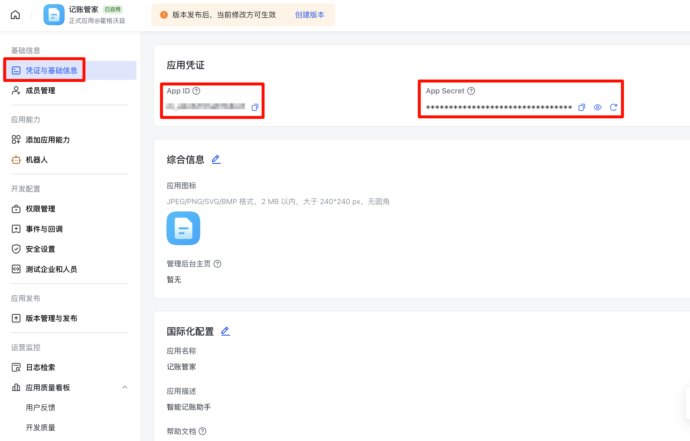
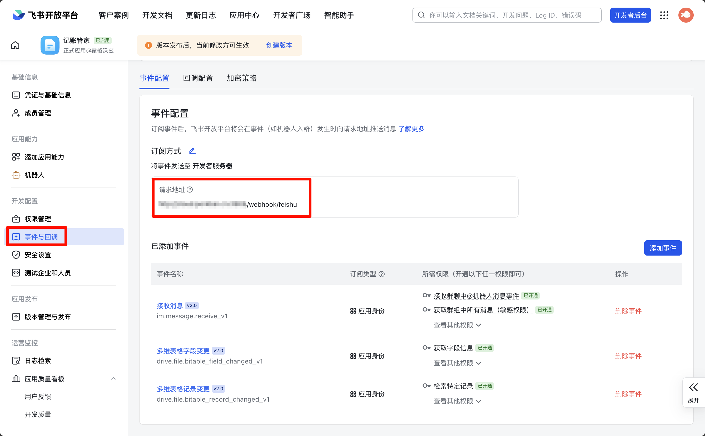
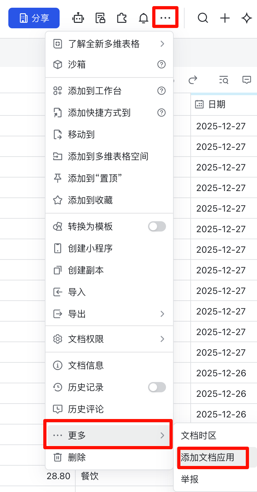

# LedgerBot 部署文档

本文档将指导您完成 LedgerBot 的完整部署流程，包括飞书机器人创建、飞书云文档配置和后端服务部署。

---

## 一、飞书机器人创建

### 1.1 创建企业自建应用

1. 访问 [飞书开放平台](https://open.feishu.cn/app?lang=zh-CN)，点击 **"创建企业自建应用"** 按钮

2. 填写应用基本信息：
   - **应用名称**：可以自定义，但需要与后端配置文件中的 `FEISHU_BOT_NAME` 保持一致
   - 默认应用名称为：**"记账管家"**
   - 如果修改了应用名称，请确保在后端配置文件中同步更新 `FEISHU_BOT_NAME` 环境变量

3. 创建完成后，进入应用的 **"凭证与基础信息"** 页面

4. 在该页面中，您需要记录以下信息（后续配置后端服务时会用到）：
   - **App ID**：应用唯一标识
   - **App Secret**：应用密钥（点击"显示"按钮查看）

   > 💡 **提示**：请妥善保管 App Secret，不要泄露给他人

   

### 1.2 配置应用权限

1. 在应用管理页面，点击左侧菜单的 **"权限管理"**

2. 在权限列表中，开通以下权限：

   - **删除记录** - `base:record:delete`
   - **检索特定记录** - `base:record:read`
   - **根据条件搜索记录** - `base:record:retrieve`
   - **更新记录** - `base:record:update`
   - **创建与更新卡片** - `cardkit:card:write`
   - **获取与发送单聊、群组消息** - `im:message`
   - **接收群聊中@机器人消息事件** - `im:message.group_at_msg:readonly`
   - **获取群组中所有消息（敏感权限）** - `im:message.group_msg`
   - **语音识别** - `speech_to_text:speech`
   - **查看知识库** - `wiki:wiki:readonly`

3. 开通权限后，确保所有权限状态显示为 **"已开通"**

### 1.3 发布应用

1. 在应用管理页面，点击左侧菜单的 **"版本管理与发布"**

2. 创建新版本并发布应用

3. 发布成功后，应用即可正常使用

### 1.4 配置事件订阅

1. 在应用管理页面，点击左侧菜单的 **"开发配置"** → **"事件与回调"**

2. 在 **"事件配置"** 标签页中，配置请求地址：
   - 订阅方式选择：**"将事件发送至开发者服务器"**
   - 请求地址填写：`http://your-domain:3906/webhook/feishu`
     > 💡 **提示**：请将 `your-domain` 替换为您的服务器公网 IP 或域名

   

3. 点击 **"添加事件"** 按钮，添加以下事件：

   - **接收消息** - `im.message.receive_v1`
   - **多维表格字段变更** - `drive.file.bitable_field_changed_v1`
   - **多维表格记录变更** - `drive.file.bitable_record_changed_v1`

4. 确保所有事件都已成功添加，并检查所需权限是否已开通

---

## 二、飞书云文档创建

### 2.1 创建多维表格

1. 访问模板链接：[记账模板](https://vwdya8uzqqn.feishu.cn/wiki/LmVPwuesUi3thDk2KL0ci8T0nAf?from=from_copylink)

2. 点击 **"使用该模板"** 按钮

3. 系统将基于该模板创建一个新的云文档，这个文档将作为后续记账的数据库

4. 创建完成后，您可以在飞书中看到新创建的多维表格文档

### 2.2 添加文档应用

1. 在创建的多维表格文档中，点击右上角的 **"更多"** 按钮

2. 在下拉菜单中选择 **"添加文档应用"**

3. 在弹出的应用列表中，找到并选择之前创建的飞书机器人应用（如"记账管家"）

4. 将机器人应用添加到文档中

   

### 2.3 获取表格 URL

1. 在飞书中打开您的多维表格文档

2. 复制浏览器地址栏的完整 URL

3. URL 格式示例：`https://example.feishu.cn/wiki/YOUR_WIKI_ID?table=YOUR_TABLE_TOKEN`

4. 保存此 URL，后续配置后端服务时会用到

---

## 三、后端服务部署

### 3.1 源码部署

**前置要求**：需要安装 Go 1.21 或更高版本

1. **配置环境变量**

   在项目根目录创建 `.env` 文件：

   ```bash
   # 复制模板（如果存在）
   cp .env.example .env
   
   # 编辑 .env 文件，填入以下配置
   ```

   **必需的环境变量：**
   ```bash
   # 飞书应用配置（从 1.1 步骤中获取）
   FEISHU_APP_ID=你的app_id
   FEISHU_APP_SECRET=你的app_secret
   
   # 飞书多维表格 URL（从 2.3 步骤中获取）
   FEISHU_BITABLE_URL=https://example.feishu.cn/wiki/YOUR_WIKI_ID?table=YOUR_TABLE_TOKEN
   
   # AI 配置（SiliconFlow）
   # 获取 API Key 和模型：访问 https://cloud.siliconflow.cn/me/models
   AI_API_KEY=你的siliconflow_api_key
   AI_BASE_URL=https://api.siliconflow.cn
   AI_MODEL=Pro/deepseek-ai/DeepSeek-V3.2
   ```

   **可选的环境变量：**
   ```bash
   # Bot 名称（需与飞书应用名称一致，默认为"记账管家"）
   FEISHU_BOT_NAME=记账管家
   
   # 服务器配置
   SERVER_PORT=3906
   
   # AI 模型配置（已在必需变量中配置，如需修改可在此处覆盖）
   AI_BASE_URL=https://api.siliconflow.cn
   AI_MODEL=Pro/deepseek-ai/DeepSeek-V3.2
   
   # 数据存储配置
   DATA_DIR=./data
   LOG_LEVEL=info
   ```

2. **安装依赖**
   ```bash
   go mod tidy
   ```

3. **运行服务**
   ```bash
   go run main.go
   ```

   或编译后运行：
   ```bash
   go build -o ledgerbot .
   ./ledgerbot
   ```

   服务将在 `http://localhost:3906` 启动

### 3.2 Docker 部署

**前置要求**：需要安装 Docker

1. **构建 Docker 镜像**
   ```bash
   docker build -t ledgerbot:latest .
   ```

2. **启动容器**

   在启动命令中直接传递环境变量：

   ```bash
   docker run -d \
     --name ledgerbot \
     -p 3906:3906 \
     -v /path/to/data:/data \
     -e SERVER_PORT=3906 \
     -e DATA_DIR=/data \
     -e TZ=Asia/Shanghai \
     -e FEISHU_APP_ID=你的app_id \
     -e FEISHU_APP_SECRET=你的app_secret \
     -e FEISHU_BITABLE_URL=你的表格URL \
     -e AI_API_KEY=你的siliconflow_api_key \
     -e AI_BASE_URL=https://api.siliconflow.cn \
     -e AI_MODEL=Pro/deepseek-ai/DeepSeek-V3.2 \
     --restart unless-stopped \
     ledgerbot:latest
   ```

   > 💡 **说明**：
   > - `-v /path/to/data:/data`：将主机数据目录挂载到容器，确保数据持久化
   > - `-e`：通过环境变量传递配置参数，请将示例中的值替换为实际配置
   > - `--restart unless-stopped`：容器自动重启策略

3. **查看容器状态和日志**
   ```bash
   docker ps
   docker logs -f ledgerbot
   ```

---

## 四、验证部署

部署完成后，验证服务是否正常运行：

1. **健康检查**
   ```bash
   curl http://localhost:3906/health
   ```
   预期返回：`OK`

2. **在飞书中测试机器人**
   
   在飞书群聊中 @机器人，发送测试消息：
   - "午饭30元"
   - "查询今天的账单"
   
   检查是否收到机器人回复。

